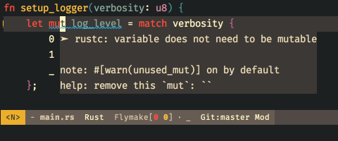
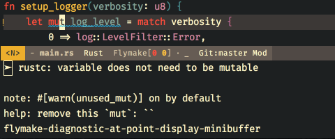

# flymake-diagnostic-at-point

Minor mode for showing flymake diagnostics at point.

The diagnostics may be displayed in a popup or in the minibuffer. You may also
provide a custom display function to use instead.




## Installation

Save the `.el` file in your Emacs' load path.

## Usage

Add the following to your `init.el`:

``` emacs-lisp
(eval-after-load 'flymake
  (require 'flymake-diagnostic-at-point)
  (add-hook 'flymake-mode-hook #'flymake-diagnostic-at-point-mode))
```

Alternatively, if you prefer using `use-package`:

``` emacs-lisp
(use-package flymake-diagnostic-at-point
  :after flymake
  :config
  (add-hook 'flymake-mode-hook #'flymake-diagnostic-at-point-mode))
```

## Customization

There are a few customizable variables:

- `flymake-diagnostic-at-point-timer-delay` controls the delay in seconds before displaying the diagnostics at point
- `flymake-diagnostic-at-point-error-prefix` defines the string to be displayed before each error line (e.g. "➤ ")
- `flymake-diagnostic-at-point-display-diagnostic-function` is the display function to be used. It can be set to `flymake-diagnostic-at-point-display-popup` to display in a popup, `flymake-diagnostic-at-point-display-minibuffer` to display in the minibuffer, or any other  function of your choosing that takes a string argument
